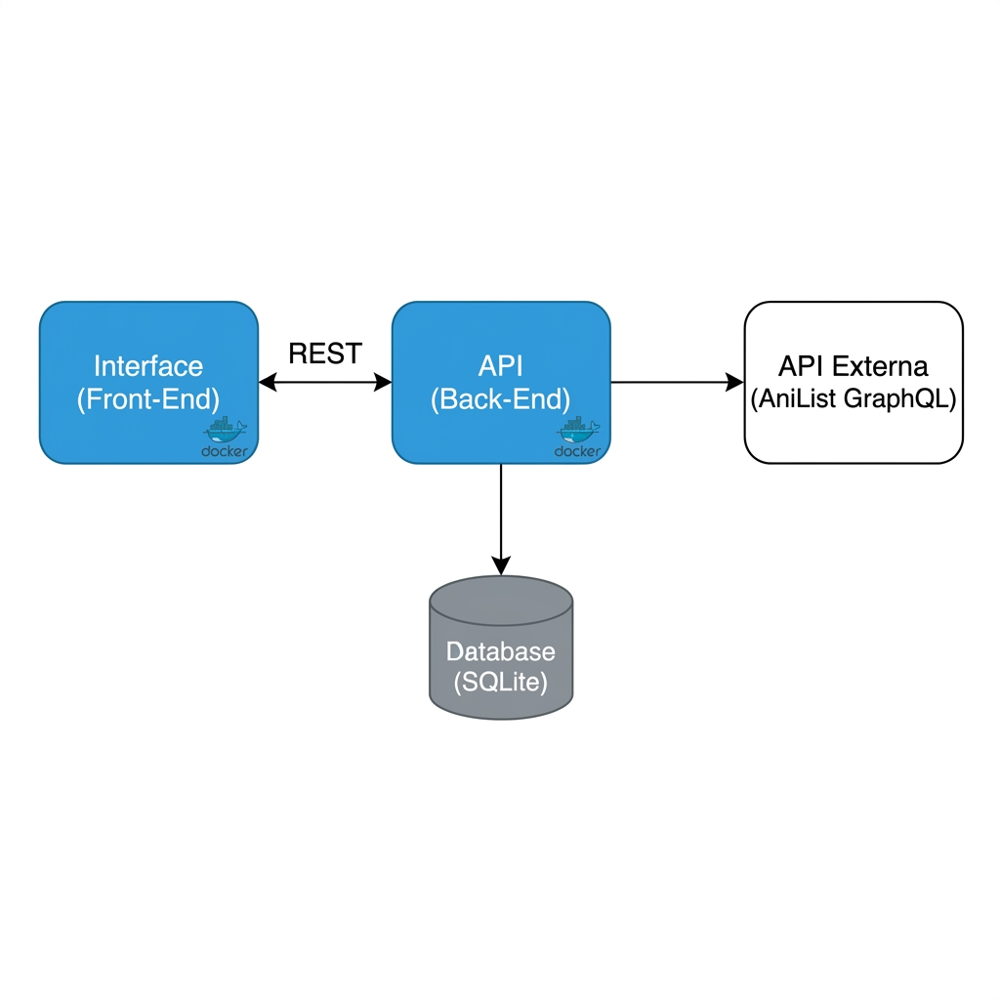

# MyAnimeList - Interface

Este repositório contém o front-end do projeto **MyAnimeList**, desenvolvido como parte do MVP para a Sprint de Desenvolvimento Full Stack Avançado. A interface permite gerenciar uma lista de animes favoritos, realizar buscas em tempo real e atribuir notas aos títulos.

---

## 🎨 Design e Funcionalidades

- **Tema Sakura Noir**: Uma interface moderna e elegante com tons de cerejeira e modo escuro.
- **Busca Avançada**: Filtros por título, gênero e ordenação dinâmica.
- **Gestão de Favoritos**: CRUD completo (Adicionar, Ver, Avaliar e Remover).
- **Tradução Automática**: Sinopses traduzidas para o português (processadas pelo backend).

---

## 🏗️ Arquitetura do Sistema

A aplicação segue o modelo de microcomponentização, onde o front-end consome uma API principal (wrapper), que por sua vez integra dados de uma API externa e persiste informações localmente. De acordo com os requisitos, o fluxograma abaixo ilustra as interações entre os componentes:



---

## 📡 API Externa Utilizada

Para a obtenção de dados atualizados sobre animes, este projeto utiliza a:
- **API**: [AniList GraphQL API](https://anilist.co/)
- **Licença**: Free/Public (uso não comercial).
- **Cadastro**: Não obrigatório para leitura de dados públicos.
- **Rotas Consumidas**: Endpoints de busca, detalhes de mídia e coleção de gêneros via GraphQL.

---

## 🛠️ Como Executar

### Pré-requisitos
- Node.js (v20+)
- pnpm (`npm install -g pnpm`)
- Docker (opcional)

### Opção 1: Desenvolvimento Local
1. Instale as dependências:
   ```bash
   pnpm install
   ```
2. Inicie o servidor de desenvolvimento:
   ```bash
   pnpm start
   ```
3. Acesse `http://localhost:4200`.

### Opção 2: Via Docker
1. Construa a imagem:
   ```bash
   docker build -t my-anime-list-front .
   ```
2. Execute o container:
   ```bash
   docker run -p 80:80 my-anime-list-front
   ```
3. Acesse `http://localhost:80`.

---

## 📁 Estrutura de Pastas
- `src/app/pages`: Componentes de página (Home, Busca, Favoritos, Detalhes).
- `src/app/domain`: Serviços e modelos de domínio para comunicação com a API.
- `public`: Ativos estáticos e configurações globais.
